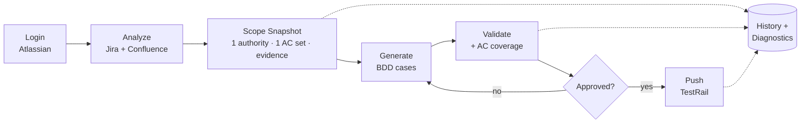

# QA Agent — Acceptance-criteria test case generator

Internal QA app that turns messy Jira + Confluence scope into **traceable BDD test cases**, validates them against a canonical acceptance-criteria set, and pushes approved output to TestRail. Built for tickets where requirements are split across a main Jira task, a parent Story, and a PRD subsection.



**Trust model:** the LLM only *drafts* cases. Scope precedence, validation, coverage, and push gating are deterministic app code — push is blocked until QA explicitly approves.

## Capabilities

| Area | What it does |
|---|---|
| **Scope analysis** | Builds one canonical context from the main issue, linked issues, parent Story, and linked PRD pages. Per-run toggles: FE-only, BE already tested, include comments, QA notes. |
| **Deterministic precedence** | Fixed source order — `main_jira` → `parent_story_confluence_section` → `parent_story_jira` — so scope never broadens just because nearby content exists. |
| **Thin-ticket PRD fallback** | When a task is thin/empty, falls back to the Story and ranks PRD subsections by ticket title. Records match quality: `confident` / `broad` / `none`. |
| **Canonical AC synthesis** | Produces one final AC set *before* generation, reused by generation, evidence, validation, coverage, and push gating. |
| **AC granularity repair** | Drops fragments, synthesizes testable AC from technical prose, and splits over-merged criteria. |
| **Source excerpts** | Attaches a quoted supporting line (`verbatim` / `closest match`) from the chosen authority to each AC; suppresses generic boilerplate and schema/table noise. |
| **BDD generation** | Typed cases (happy / negative / edge). Tries OpenAI, falls back to DeepSeek only on quota / rate-limit / billing / token / context-length errors. |
| **Validation + coverage** | Checks title format, main-ticket Jira reference, BDD structure, FE-only scope, AC mapping, and coverage vs the final AC set. |
| **Evidence hydration** | Each case maps back to its PRD section, covered AC, and a coverage note. |
| **Regenerate diff** | Regeneration produces a candidate set and a diff (added/removed/changed); the current draft is replaced only on accept. |
| **Approval-gated push** | Push requires cases that pass validation + coverage, an explicit approval, and a section ID. Uses `template_id: 4` via `custom_testrail_bdd_scenario`. |
| **Workflow history** | Persists `analysis` / `generation` / `push` runs for later inspection. |
| **Diagnostics** | Atlassian / LLM / TestRail / DB readiness, persistence mode, migration version, recent warn/error issues. |
| **Translation** | Scope Snapshot toggles EN / ID. Generated BDD and TestRail push content stay English. |
| **Toasts** | Global async feedback (analyze/generate/push success & failure); per-case validation stays inline. |

## Scope Snapshot

The main trust surface before generation. Shows: ticket, epic, AC source, confidence, main summary, parent Story, scoped PRD section, confidence summary, user stories, and the final acceptance criteria. **Scope diagnostics** add: thin-ticket fallback used, PRD match quality, matched PRD heading, and discarded user-story fragment count.

## API

| Endpoint | Purpose |
|---|---|
| `GET /api/config` | Readiness + auth status |
| `GET /api/healthz` | Public lightweight health check (DB ping when Postgres active) |
| `GET /api/diagnostics` | Runtime diagnostics |
| `GET /api/history/runs` · `/:id` | Workflow history list / detail |
| `POST /api/analyze` | Build scope snapshot from a Jira key |
| `POST /api/context/translate` | Translate Scope Snapshot (EN→ID) |
| `POST /api/generate` | Generate BDD cases |
| `POST /api/validate` | Validate cases + coverage |
| `POST /api/push` | Approval-gated TestRail push |
| `POST /api/logout` | Clear session |
| `GET /auth/atlassian` · `/callback` | OAuth 3LO flow |

## Quick start

```bash
npm install
cp .env.example .env      # then fill in the variables below
npm run dev               # client :5173 · API :5180
```

Create an Atlassian OAuth 3LO app and set its callback to `http://localhost:5180/auth/atlassian/callback` for dev. Production start path: `npm start` (builds + serves from the Node server, default `:5174`).

### Environment

| Variable | Required | Notes |
|---|---|---|
| `ATLASSIAN_CLIENT_ID` / `_SECRET` | ✅ | OAuth 3LO app credentials |
| `ATLASSIAN_REDIRECT_URI` | prod | Must match the OAuth callback URL |
| `ATLASSIAN_SCOPES` | prod | e.g. `read:jira-work read:confluence-content.all read:confluence-space.summary offline_access` |
| `DATABASE_URL` | prod | Enables Postgres persistence; dev falls back to `file+memory` if init fails |
| `DEEPSEEK_API_KEY` / `OPENAI_API_KEY` | ✅ (≥1) | OpenAI is the default primary LLM (`gpt-5.4-mini`) for AC synthesis and BDD generation, with DeepSeek as fallback (`deepseek-v4-pro`). A DeepSeek evaluation found it under-covers and emits invalid case shapes on this repo's structured workflow, so it's fallback/opt-in only. Override order with `LLM_PRIMARY_PROVIDER=deepseek`; override models with `DEEPSEEK_MODEL` / `OPENAI_MODEL` |
| `LLM_RETRY_ATTEMPTS` / `LLM_MAX_OUTPUT_TOKENS_*` | optional | Defaults to one same-provider retry for empty/malformed/truncated JSON. Per-task output caps are available for `GENERATION`, `SYNTHESIS`, `TRANSLATION`, `DUPLICATE_REVIEW`, `EXCERPT_RELEVANCE`, and `ENDPOINT_SELECTION` |
| `LLM_DEEPSEEK_FAST_GENERATION` | optional | Defaults to `false` (full-quality generation: scenario-plan + polarity repair run). Set to `true` to skip those repair passes on DeepSeek to reduce latency — at the cost of coverage, so use only for deliberate speed experiments |
| `LLM_DEEPSEEK_FAST_AC` | optional | Defaults to `false`. Keep quality-first AC synthesis on for DeepSeek; set to `true` only for deliberate latency experiments after deterministic AC quality gates pass |
| `API_DOCS_URL` | optional | Default API documentation URL for API/hybrid ticket analysis; per-analysis override is available in the UI |
| `TESTRAIL_BASE_URL` / `_USER` / `_API_KEY` | for push | TestRail credentials. `TESTRAIL_SECTION_ID` optional default |
| `TESTRAIL_PROJECT_ID` | recommended for push | Enables the pre-push duplicate check that searches existing TestRail cases by Jira ref. Push still works without it, but duplicate review is skipped |
| `ENCRYPTION_KEY` | prod | Encrypts stored Atlassian session tokens and per-user TestRail API keys. Rotating it invalidates encrypted stored credentials unless you migrate/re-encrypt them |
| `QA_AGENT_PORT` / `QA_AGENT_BASE_URL` | optional | Override host/port for `npm start` |
| `DATABASE_CA_CERT` | hosted DBs | Optional CA bundle for remote Postgres TLS verification when the provider is not trusted by the default Node trust store |

Persistence-backed data: sessions, audit events, workflow history, push history. Migrations apply from `src/server/migrations`. Atlassian refresh tokens are stored and used to refresh access tokens. Production should use Postgres (not fallback mode) and must not rely on a committed `.env`.

## Commands

| Command | Purpose |
|---|---|
| `npm run dev` | Vite client + Node API together |
| `npm start` | Build + serve production bundle |
| `npm run build` | Build client and server |
| `npm test` | Full suite (`test:server` + `test:client`) |
| `npm run typecheck` | TypeScript checks (server + client) |
| `npm run review:qa` | QA review gate (see below) |

**Node:** `^20.19.0 || >=22.12.0`.

## Testing

- **Server:** context building, source precedence, thin-ticket PRD fallback, AC synthesis/repair, source-excerpt selection, validation + coverage.
- **Client:** Scope Snapshot diagnostics, EN/ID toggle, utility modals, evidence rendering, toasts.
- **Regression fixtures:** strong technical-design tickets, thin Jira + PRD fallback, explicit-AC tickets.

Production logic stays ticket-neutral even where tests use specific Jira fixtures.

## QA reviewer gate

Run `npm run review:qa` before committing non-trivial changes to scope resolution, generation, validation, review UI, or TestRail behavior. A `pre-commit` hook blocks commits until the staged tree passes; guidance lives in [`docs/qa-reviewer-agent.md`](docs/qa-reviewer-agent.md). Docs-only edits may skip it. The reviewer focuses on QA trust: source precedence, PRD matching, AC quality, case mapping, coverage correctness, push safety, and Scope Snapshot readability.

## Deployment (Railway)

Start command `npm start`; set the env vars above with `QA_AGENT_BASE_URL=https://<domain>` and `ATLASSIAN_REDIRECT_URI=https://<domain>/auth/atlassian/callback`, point the Atlassian OAuth callback at the same URL, and ensure `DATABASE_URL` is set for persistent operation.
